# NiPharm — Drug Shortage Intelligence Platform

> Predict NHS drug price concessions **4–6 weeks before they happen.**
> Real-time ML + live wholesaler bid pricing for UK community pharmacies.

**Live Site:** https://nipharm-shortage-intelligence.vercel.app &nbsp;|&nbsp; **Backend:** https://npt-stock-intel-production.up.railway.app/ping

   

---

## What It Does

NiPharm monitors **758 generic and branded drugs** across the UK supply chain and predicts which ones will hit an NHS NCSO price concession next month — before CPE publishes the tariff. Pharmacies that buy at tariff price before the concession announcement lock in the margin.

- **v6 model AUC: 0.9988** (hold-out test, Jul–Dec 2025, temporal CV — zero leakage)
- **New in v6:** Live wholesale bid prices from Edinpharm buying group — 2,001 drugs, 5 wholesalers
- **Prediction lead time:** 4–6 weeks ahead of NHS tariff announcement

---

## Architecture

```mermaid
flowchart TB

    %% ═══════════════════════════════════════════════
    %%  USER LAYER
    %% ═══════════════════════════════════════════════
    subgraph USERS["👥  Who Uses NiPharm"]
        direction LR
        PH["💊 Pharmacy Buyer\nSearches shortage risk\n& bulk-buy signals"]
        AD["🏢 NPT Procurement\nWeekly intelligence\nreports + recommendations"]
        EXT["🏙️ External Clients\nUK & Ireland pharmacies\n(expansion pipeline)"]
    end

    %% ═══════════════════════════════════════════════
    %%  FRONTEND — Vercel
    %% ═══════════════════════════════════════════════
    subgraph FE["🖥️  Frontend  ·  Vercel  ·  React 18 + TypeScript"]
        direction LR
        DASH["📊 Dashboard\nBuy before prices rise\nLive KPIs + signals"]
        RISK["🔍 Drug Search\nML risk scores\n758 drugs"]
        LENS["🔬 Concession Lens\nNL → SQL queries\nover CPE history"]
        ANA["📈 Analytics\nTrend charts · Supply\norigin · FX cards"]
        CALC["🧮 Calculator\nNHS tariff savings\nBulk discount tiers"]
        CHAT["💬 AI Chat\nGroq llama-3.3-70b\n+ Tavily search"]
        REP["📋 Weekly Report\nIntelligence brief\nPrint-optimised"]
    end

    %% ═══════════════════════════════════════════════
    %%  BACKEND — Railway
    %% ═══════════════════════════════════════════════
    subgraph BE["⚙️  Backend  ·  Railway  ·  FastAPI + Python 3.11"]
        direction TB

        subgraph ML_ENG["🤖  ML Engine  (v6)"]
            XGB["⚡ XGBoost\nCalibrated · AUC 0.9988\nDeployed primary"]
            RF["🌲 Random Forest\nCalibrated · AUC 0.9985\nFallback"]
            FEAT["📐 47 Features\nTemporal walk-forward CV\n1-month gap · zero leakage"]
        end

        subgraph ENDPTS["🔌  API Endpoints"]
            E1["POST /predict\n70% ML + 30% live signals\n6hr TTL cache"]
            E2["POST /query\nNL → SQL · DuckDB\n200-row cap · read-only"]
            E3["POST /chat\nGroq LLM + Tavily\n< 120 words · bullet format"]
            E4["GET /news · /mhra-alerts\n/weekly-report · /signals\n/ping · /debug"]
        end

        subgraph STORE["📁  Model Artifacts"]
            PKL["panel_model_xgb.pkl\n1.4 MB · XGBoost · v6"]
            RFPKL["panel_model.pkl\n5.0 MB · RF · fallback"]
            FCOLS["panel_feature_cols.json\n47 features · auto-loaded"]
        end
    end

    %% ═══════════════════════════════════════════════
    %%  AI SERVICES
    %% ═══════════════════════════════════════════════
    subgraph AI["🧠  AI Services"]
        GROQ["Groq\nllama-3.3-70b-versatile\nChat + NL→SQL"]
        TAV["Tavily Search\nReal-time web context\nfor AI responses"]
    end

    %% ═══════════════════════════════════════════════
    %%  LIVE PUBLIC DATA
    %% ═══════════════════════════════════════════════
    subgraph PUBLIC["📡  Live Public Data"]
        CPE["CPE / NHSBSA\nMonthly concessions\n+ Drug Tariff"]
        ECB["Frankfurter / ECB\nGBP/INR · GBP/CNY\nGBP/USD live FX"]
        MHRA["MHRA Gov.uk\nShortage publications\n3,372 alerts scraped"]
        RSS["RSS Feeds\nNHS England · BBC Health\nPharmaTimes · MHRA"]
    end

    %% ═══════════════════════════════════════════════
    %%  WHOLESALER DATA  ← NEW in v6
    %% ═══════════════════════════════════════════════
    subgraph WHOLESALE["🏭  Wholesaler Buy-Side Data  ·  Local Only"]
        EP["🛒 Edinpharm Dashboard\nedinpharm.com\n2,001 drugs · 5 wholesalers\nTRI · AAH · BW · ETH · PHD"]
        AAH["📦 AAH Hub\nSalesforce Aura API\nLive price + stock"]
        ALL["📄 Alliance Healthcare\nLiferay REST API\nMonthly invoices (PDF)"]
    end

    %% ═══════════════════════════════════════════════
    %%  SCRAPER PIPELINE — Local
    %% ═══════════════════════════════════════════════
    subgraph PIPE["🔄  Monthly Scraper Pipeline  ·  Local Only  ·  Never on GitHub"]
        direction TB
        S1["📥 Public Data Scrapers\n01 NHSBSA Tariff · 02 CPE · 08 CPE Archive\n04 MHRA · 13 OpenPrescribing · 16 yfinance\n17 BSO NI · 19 MHRA Mfr Count · 22 FDA"]
        S2["🏭 Wholesaler Scrapers\n45 Edinpharm Prices ← NEW\n25 AAH Hub · 26 Alliance Docs\n28 Chrome Cookie Extractor"]
        S3["⚙️ Feature Engineering\n46 Wire Edinpharm Features ← NEW\n11 Feature Store Builder\n23 Invoice Price Pipeline"]
        S4["🧪 Model Training\n12 RF + XGBoost + Calibration\n→ panel_model_xgb.pkl (1.4MB)\n→ panel_model.pkl (5.0MB)"]
    end

    %% ═══════════════════════════════════════════════
    %%  CI/CD
    %% ═══════════════════════════════════════════════
    subgraph CICD["📦  GitHub (Private)  →  Auto Deploy"]
        direction LR
        GH["skyward-27/\nnipharm-shortage-intelligence"]
        VC["Vercel\n~2 min deploy\nCI=false build"]
        RW["Railway\n~3–5 min deploy\nDockerfile"]
    end

    %% ═══════════════════════════════════════════════
    %%  CONNECTIONS
    %% ═══════════════════════════════════════════════
    USERS -->|"HTTPS"| FE
    FE -->|"REST API"| BE

    E1 --> XGB & RF
    E2 --> GROQ
    E3 --> GROQ
    GROQ --> TAV

    BE -->|"FX rates"| ECB
    BE -->|"News RSS"| RSS
    BE -->|"Live concessions"| CPE

    EP -->|"cookie auth\nmonthly"| S2
    AAH & ALL -->|"session cookies"| S2

    S1 -->|"CSVs"| S3
    S2 -->|"wholesaler CSVs"| S3
    S3 -->|"47-feature panel\n44,074 rows"| S4
    S4 -->|"git push .pkl"| GH

    PUBLIC --> S1
    MHRA --> S1

    GH --> VC --> FE
    GH --> RW --> BE

    XGB & RF --> STORE

    %% ═══════════════════════════════════════════════
    %%  STYLES
    %% ═══════════════════════════════════════════════
    classDef userStyle    fill:#fff3e0,stroke:#f57c00,color:#bf360c,font-weight:bold
    classDef feStyle      fill:#e3f2fd,stroke:#1565c0,color:#0d47a1,font-weight:bold
    classDef beStyle      fill:#f3e5f5,stroke:#6a1b9a,color:#4a148c,font-weight:bold
    classDef mlStyle      fill:#ede7f6,stroke:#4527a0,color:#311b92,font-weight:bold
    classDef aiStyle      fill:#fff8e1,stroke:#f9a825,color:#e65100,font-weight:bold
    classDef pubStyle     fill:#e8f5e9,stroke:#2e7d32,color:#1b5e20,font-weight:bold
    classDef wsStyle      fill:#fce4ec,stroke:#ad1457,color:#880e4f,font-weight:bold
    classDef pipeStyle    fill:#e0f2f1,stroke:#00695c,color:#004d40,font-weight:bold
    classDef cicdStyle    fill:#f5f5f5,stroke:#424242,color:#212121,font-weight:bold

    class PH,AD,EXT userStyle
    class DASH,RISK,LENS,ANA,CALC,CHAT,REP feStyle
    class E1,E2,E3,E4,PKL,RFPKL,FCOLS beStyle
    class XGB,RF,FEAT mlStyle
    class GROQ,TAV aiStyle
    class CPE,ECB,MHRA,RSS pubStyle
    class EP,AAH,ALL wsStyle
    class S1,S2,S3,S4 pipeStyle
    class GH,VC,RW cicdStyle
```



### Component Summary

| Layer | Tech | Hosted |
|-------|------|--------|
| Frontend | React 18 + TypeScript, CSS-in-JSX, hand-coded SVG charts | Vercel (auto-deploy) |
| Backend | Python 3.11 FastAPI + Groq LLM | Railway (Dockerfile, auto-deploy) |
| ML — Primary | XGBoost calibrated, AUC **0.9988** | GitHub → Railway |
| ML — Fallback | Random Forest calibrated, AUC **0.9985** | GitHub → Railway |
| Data Explorer | DuckDB in-process NL→SQL | Railway |
| AI Chat | Groq llama-3.3-70b + Tavily search | Railway |
| Wholesaler Data | Edinpharm · AAH Hub · Alliance Healthcare (local only) | Local scraper |
| Scrapers | 28 Python scripts, monthly manual run | Local only |

---

## ML Model — v6 (Deployed April 2026)

### What's New in v6

**Edinpharm wholesale bid prices wired as 5 new features:**

| Feature | Description | Signal |
|---------|-------------|--------|
| `edinpharm_available` | Drug listed in Edinpharm buying group | Coverage flag |
| `edinpharm_min_gbp` | Lowest bid price across all 5 wholesalers | Buy-side floor |
| `price_vs_edinpharm_pct` | NHS tariff vs wholesaler bid gap (%) | **Key shortage signal** — positive = tariff above bid |
| `edinpharm_price_spread` | (max−min)/min across wholesalers | Competition proxy — high spread = unstable supply |
| `edinpharm_winner_PHD` | Phoenix Drug holds cheapest bid | Supplier concentration flag |

**98.2% drug match rate** — Exact name+pack (39,685 rows), exact name (2,066), fuzzy (1,548), unmatched (775).

---

### Performance — v5 vs v6

| Metric | v5 | v6 |
|--------|----|----|
| Features | 42 | **47** |
| New signals | Seasonal, SSP, drug age, cascade | **+ Edinpharm bid prices** |
| Walk-forward CV AUC (RF) | 0.9972 ± 0.0008 | 0.9971 ± 0.0008 |
| Walk-forward CV AUC (XGB) | 0.9977 ± 0.0008 | 0.9975 ± 0.0011 |
| Hold-out AUC — RF calibrated | 0.9986 | 0.9985 |
| Hold-out AUC — XGB | 0.9987 | **0.9988** |

> **Why Edinpharm features are rank 15 and not top 3 yet:**
> v6 has one month of Edinpharm data (April 2026 snapshot). The dominant features (`conc_last_6mo`, `cpe_avail_6mo`, `concession_streak`) are powerful because they capture **momentum over months**. Once the Edinpharm scraper runs monthly and we have 3–4 months of bid price history, we can compute `edinpharm_price_trend_3mo` and `edinpharm_vs_tariff_drift` — that's the v7 alpha, and it's fully automated.

---

### Top Features — v6 (Gini Importance)

| Rank | Feature | Importance | What It Captures |
|------|---------|-----------|-----------------|
| 1 | `conc_last_6mo` | 22.8% | Concession events in last 6 months |
| 2 | `cpe_avail_6mo` | 19.6% | CPE concession availability last 6 months |
| 3 | `concession_streak` | 14.4% | Consecutive months on concession |
| 4 | `on_concession` | 9.9% | Is drug on concession this month |
| 5 | `cpe_price_gbp` | 9.8% | CPE concession price (£) |
| 6 | `price_vs_cpe_pct` | 3.7% | Tariff vs CPE price gap |
| 7 | `cpe_conc_available` | 3.6% | CPE availability flag |
| 8 | `price_mom_pct` | 2.1% | Month-on-month tariff price change |
| 9 | `bsn_same_section_conc_count` | 1.8% | Cascade — other drugs in same BNF class on concession |
| 10 | `floor_proximity` | 1.5% | Distance from 24-month price floor |
| 15 | `edinpharm_min_gbp` | **0.4%** | **← NEW: Edinpharm buy-side bid price** |

---

### Model Version History

| Version | CV AUC | Hold-out AUC | Features | Key Change |
|---------|--------|--------------|----------|------------|
| v1 (flat) | 0.891 | — | 15 | One row per drug, no time dimension |
| v2 (panel) | 0.971 | — | 18 | Time-series, streak, recency |
| v3 | 0.982 | — | 20 | Brent crude + Sun Pharma |
| v4 | 0.9983* | — | 28 | CPE price features + hybrid `/predict` endpoint |
| v5 | 0.9972 | 0.9987 | 42 | TimeSeriesSplit CV + calibration + seasonal + SSP |
| **v6 ✅ LIVE** | **0.9975** | **0.9988** | **47** | **Edinpharm wholesaler bid prices (5 new features)** |

*v4 AUC inflated — StratifiedKFold with temporal leakage. v5/v6 use clean walk-forward CV with 1-month gap.

---

### Validation Method

```
60 months of data (Jan 2021 – Dec 2025)
│
├── Train + Validation: months 1–54 (Jan 2021 – Jun 2025)
│     └── 5-fold temporal walk-forward CV
│           Fold 1: train 9mo → gap 1mo → test 9mo
│           Fold 2: train 18mo → gap 1mo → test 9mo
│           ...
│           No future data leaks into any fold
│
└── Hold-out Test: months 55–60 (Jul–Dec 2025)  ← NEVER seen in CV
      XGB AUC: 0.9988  |  RF AUC: 0.9985
```

---

## Data Sources

### Public (Scraped Monthly)

| Source | Data | Frequency | Status |
|--------|------|-----------|--------|
| NHSBSA Drug Tariff | Cat M prices (24 months) | Monthly | ✅ |
| CPE Concessions | Current + archive (Jan 2020–) | Monthly | ✅ |
| BSO NI Concessions | Northern Ireland concessions | Monthly | ✅ |
| MHRA Publications | Shortage alerts (3,372) | Ad-hoc | ✅ |
| MHRA Mfr Authorisations | Licensed manufacturer count per drug | Monthly | ✅ |
| NHSBSA SSP Register | Serious Shortage Protocols | Monthly | ✅ |
| OpenPrescribing PCA | England GP prescribing demand | Monthly | ✅ |
| NSE Pharma Stocks | 10 Indian tickers (SUNPHARMA, DRREDDY, CIPLA...) | Monthly | ✅ |
| Shipping Stress | ZIM, SBLK (freight rate proxy) | Monthly | ✅ |
| Brent Crude | Commodity supply chain stress | Daily | ✅ |
| FX Rates | GBP/INR · GBP/CNY · GBP/USD (ECB) | Daily | ✅ |
| BoE Bank Rate | Interest rates | Quarterly | ✅ |
| FDA Warning Letters | Regulatory actions on India/China manufacturers | Monthly | ✅ |
| dm+d Molecule Master | Drug dictionary (24,465 molecules) | On-demand | ✅ |

### Wholesaler Buy-Side (Local Only — Commercially Sensitive)

| Source | Data | Coverage | Status |
|--------|------|----------|--------|
| **Edinpharm Dashboard** | Live bid prices: TRI · AAH · BW · ETH · PHD | **2,001 drugs** | ✅ NEW v6 |
| AAH Hub (Salesforce) | Live wholesale price + stock | Watchlist drugs | ✅ |
| Alliance Healthcare | Monthly invoice PDFs | All invoices | ✅ |

---

## Scraper Pipeline

All scripts in `scrapers/` — run locally monthly. Output to `scrapers/data/` (not on GitHub).

### Monthly Workflow

```bash
# 1. Extract Chrome cookies (run after logging into portals)
python3 28_extract_chrome_cookies.py

# 2. Scrape wholesaler prices
python3 45_edinpharm_prices.py          # ← NEW: Edinpharm bid prices (2,001 drugs)
python3 25_download_aah_orders.py       # AAH Hub live prices
python3 26_download_alliance_documents.py  # Alliance invoices (run within 30 min of login)

# 3. Wire new features into panel
python3 46_wire_edinpharm_features.py   # ← NEW: joins Edinpharm to panel (98.2% match)
python3 11_feature_store_builder.py     # v5/v6 features

# 4. Retrain model (Terminal only — uses ~46GB RAM)
python3 12_ml_model_panel.py

# 5. Deploy
cp data/model/panel_model_xgb.pkl ../nipharma-backend/model/
git add nipharma-backend/model/ && git push
```

### All Scripts

| Script | Purpose | Status |
|--------|---------|--------|
| `01_nhsbsa_drug_tariff.py` | Cat M prices 24 months | ✅ |
| `02_ncso_price_concessions.py` | CPE current month | ✅ |
| `04_mhra_alerts.py` | MHRA shortage publications | ✅ |
| `05_market_signals.py` | FX / BoE / OpenFDA | ✅ |
| `06_molecule_master.py` | dm+d drug dictionary | ✅ |
| `08_cpe_historical_concessions.py` | CPE archive Jan 2020– | ✅ |
| `11_feature_store_builder.py` | v6 panel feature store (47 features) | ✅ |
| `12_ml_model_panel.py` | RF + XGBoost + calibration + SHAP | ✅ |
| `13_openprescribing.py` | NHSBSA PCA demand | ✅ |
| `14_nhsbsa_ssp.py` | Serious Shortage Protocol register | ✅ |
| `16_yfinance_signals.py` | 10 NSE pharma + 2 shipping tickers | ✅ |
| `17_cpni_concessions.py` | BSO NI concessions | ✅ |
| `19_mhra_manufacturer_count.py` | Licensed manufacturer counts | ✅ |
| `20_opendatani_prescribing.py` | NI GP prescribing data | ✅ |
| `21_bso_ni_shortages.py` | BSO NI shortage notices | ✅ |
| `22_fda_warning_letters.py` | FDA warning letters (India/China) | ✅ |
| `23_invoice_price_pipeline.py` | Invoice price intelligence pipeline | ✅ |
| `25_download_aah_orders.py` | AAH Hub live prices (Salesforce API) | ✅ |
| `26_download_alliance_documents.py` | Alliance Healthcare invoice PDFs | ✅ |
| `28_extract_chrome_cookies.py` | Chrome cookie extractor (AAH + Alliance + Edinpharm) | ✅ |
| `40_gphc_register.py` | GPhC pharmacy register (~12,350 UK pharmacies) | ✅ |
| `41_psi_register.py` | PSI Ireland register (~1,989 pharmacies) | ✅ |
| `42_companies_house_enrich.py` | Director names + email enrichment | ✅ |
| `43_email_outreach.py` | 3-email cold sequence (Resend, SQLite tracking) | ✅ |
| `44_seo_post_generator.py` | Monthly NHS concession SEO blog (Groq) | ✅ |
| `45_edinpharm_prices.py` | **Edinpharm bid prices — 2,001 drugs × 5 wholesalers** | ✅ **NEW** |
| `46_wire_edinpharm_features.py` | **Joins Edinpharm to panel (98.2% match, 5 features)** | ✅ **NEW** |

---

## Platform Pages

| Page | Route | Status |
|------|-------|--------|
| Dashboard | `/` | ✅ — "Buy before prices rise." hero, animated stat cards |
| Drug Search | `/drugs` | ✅ — ML predictions via `/predict` |
| Concession Lens | `/explorer` | ✅ — ChatGPT-style NL→SQL, DuckDB |
| Analytics | `/analytics` | ✅ — Trend chart, supply origin, FX cards |
| Calculator | `/calculator` | ✅ — Bulk discount tiers |
| AI Chat | `/chat` | ✅ — Groq 70b + Tavily |
| Contact | `/contact` | ✅ — World map SVG hero |
| Weekly Report | `/report` | 🔄 Redesign pending |
| Market News | `/news` | 🔄 Redesign pending |
| Alerts | `/alerts` | 🔄 Redesign pending (removed from nav) |

---

## Quick Start

### Frontend
```bash
cd nipharma-frontend
npm install
npm start                                                   # Local dev :3000
REACT_APP_API_URL=http://localhost:8000 npm start           # With local backend
```

### Backend
```bash
cd nipharma-backend
pip install -r requirements.txt
uvicorn server.main:app --reload --port 8000
```

### Retrain Model (Terminal only — ~46GB RAM)
```bash
cd scrapers
python3 28_extract_chrome_cookies.py    # extract Chrome cookies
python3 45_edinpharm_prices.py          # scrape Edinpharm
python3 46_wire_edinpharm_features.py   # wire to panel
python3 11_feature_store_builder.py     # build feature store
python3 12_ml_model_panel.py            # train — ~15 min
cp data/model/panel_model_xgb.pkl ../nipharma-backend/model/
git add nipharma-backend/model/ && git push
```

### Environment Variables
```
# Vercel (frontend)
REACT_APP_API_URL=https://npt-stock-intel-production.up.railway.app
CI=false

# Railway (backend)
GROQ_API_KEY=xxx
PORT=auto
```

---

## Roadmap

### ✅ v6 — Deployed April 2026
- Edinpharm buying group scraper (`45_edinpharm_prices.py`) — 2,001 drugs, 5 wholesalers
- Edinpharm feature wiring (`46_wire_edinpharm_features.py`) — 5 new features, 98.2% match
- Panel feature store: 47 features (up from 42)
- XGBoost hold-out AUC: **0.9988** (up from 0.9987)
- Chrome cookie extractor extended to Edinpharm
- Scraper output cleaned: separate `generics`, `brands`, `all` CSVs

### ✅ v5 — Deployed April 2026
- TimeSeriesSplit walk-forward CV with 1-month gap (fixed temporal leakage from v4)
- XGBoost trained alongside RF — XGB wins by 0.0001 AUC
- Isotonic probability calibration (CalibratedClassifierCV)
- Hold-out test set: last 6 months (Jul–Dec 2025), never seen in CV
- 42 features: seasonal sin/cos, is_winter, cascade count, SSP flag, drug age, India pharma stress
- Both models deployed: `panel_model_xgb.pkl` (1.4MB) + `panel_model.pkl` (5.0MB)

### v7 — Planned (Q3 2026)
- `edinpharm_price_trend_3mo` — requires 3+ months of Edinpharm history (monthly scraper already set up)
- `edinpharm_vs_tariff_drift` — wholesale bid rising above tariff = early shortage signal
- Fix SHAP explainability (blocked by numba/llvmlite incompatibility with calibrated wrapper)
- Region selector: England / Scotland / NI / Ireland tariff switching
- Pricing page: Starter £49 / Professional £99 / Enterprise £299

---

## GitHub Policy

| Location | On GitHub | Reason |
|----------|-----------|--------|
| `nipharma-frontend/` | ✅ Yes | React app |
| `nipharma-backend/` | ✅ Yes | FastAPI + model .pkl files |
| `scrapers/*.py` | ✅ Yes | Scraper source code |
| `scrapers/data/` | ❌ No | CSV data files — large, local only |
| `NPT_Invoice_Data/` | ❌ NEVER | Invoices, supplier prices — commercially sensitive |
| `sessions/*.json` | ❌ NEVER | Login cookies for AAH, Alliance, Edinpharm |
| `.env` / `.env.local` | ❌ No | API keys |

---

## Key API Endpoints

```
POST /predict           ML shortage prediction — 47 features, 70% ML + 30% live signals, 6hr cache
GET  /ping              Backend health check
GET  /news              Pharmaceutical news feed (RSS)
GET  /mhra-alerts       MHRA shortage publications
GET  /signals           Live GBP/INR, GBP/CNY, GBP/USD (Frankfurter/ECB)
POST /chat              Groq llama-3.3-70b + Tavily + CPE/MHRA local lookup
POST /query             NL or SQL → DuckDB (read-only, 200-row cap)
GET  /weekly-report     Intelligence summary
GET  /debug             Model info, file paths, API key status
```

---

**Last updated:** April 2026 &nbsp;|&nbsp; **Model:** v6 XGBoost AUC 0.9988 · RF AUC 0.9985 (hold-out, temporal CV) &nbsp;|&nbsp; **Status:** Production &nbsp;|&nbsp; **License:** Proprietary
