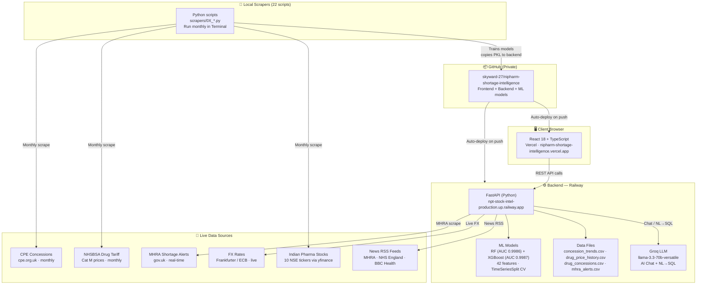

# NiPharma — Stock Intelligence Platform

A real-time pharmaceutical shortage prediction platform for UK community pharmacies. Uses ensemble ML (Random Forest + XGBoost, AUC 0.9986) combined with live market signals to predict NHS drug concessions before they happen — enabling pharmacists to stock at tariff price before prices surge.

**Live Site:** https://nipharm-shortage-intelligence.vercel.app

---

## Key Features

- **Dashboard** — Bloomberg-style two-column layout: top 6 bulk-buy opportunities (ranked by margin vs NHS Tariff) + live KPIs, pharma news, and quick actions
- **Risk Finder** — ML-powered shortage risk predictions for 758 drugs (renamed from "Drug Search")
- **Buying Recs** — Top 5 premium ranked cards with colour-coded savings badges + hold warnings
- **AI Chat** — Floating popup (💬 bottom-right), available on every page — Groq llama-3.3-70b + Tavily + local CPE/MHRA lookup
- **Shortage Intelligence** — ML predictions updated monthly + real-time signal boosting (70% ML + 30% live signals)
- **Market News** — Live RSS feeds from MHRA, NHS England, BBC Health, PharmaTimes (no API key)
- **Alerts** — MHRA shortage publications with real-time scraping
- **Weekly Report** — Newspaper-style intelligence brief (printable)
- **Tariff Calculator** — NHS price lookup + bulk discount estimator

---

## Architecture



### Component Table

| Component | Tech | Hosted |
|-----------|------|--------|
| Frontend | React 18 + TypeScript | Vercel (auto-deploy) |
| Backend | Python FastAPI + Groq LLM | Railway (auto-deploy) |
| ML Models | RF + XGBoost, scikit-learn, calibrated | GitHub → Railway |
| Data Explorer | DuckDB in-process SQL (planned) | Railway |
| AI Chat | Groq llama-3.3-70b + Tavily search | Railway |
| News | Free RSS feeds (no API key) | Railway |
| Scrapers | 22 Python scripts, run locally monthly | Local only |

### Key Endpoints

```
POST   /predict              # ML shortage prediction (43 features, 6hr TTL cache)
GET    /health               # Backend status
GET    /news                 # Pharmaceutical news feed
GET    /mhra-alerts          # MHRA shortage publications
GET    /signals              # Real-time GBP/INR, GBP/CNY, GBP/USD from ECB
GET    /concessions          # Current CPE concession data
POST   /chat                 # Groq LLM + Tavily search + local CPE/MHRA lookup
GET    /weekly-report        # Intelligence summary
POST   /contact              # Contact form
```

---

## ML Model

### v5 — DEPLOYED ✅ (April 2026)

**Calibrated Random Forest + XGBoost Ensemble**
- Training data: 44,074 rows (758 drugs × 60 months, Jan 2021 – Dec 2025)
- Features: **42** (removed 2 constant columns from 44)
- Positive label rate: 14.7% (drug goes on concession next month)

**Validation (temporal walk-forward, no leakage):**
| Metric | Score |
|--------|-------|
| Walk-forward CV AUC (5 folds, 1-month gap) | **0.9972 ± 0.0008** |
| Hold-out test AUC — RF calibrated (Jul–Dec 2025) | **0.9986** |
| Hold-out test AUC — XGBoost (Jul–Dec 2025) | **0.9987** |
| XGBoost CV mean AUC | 0.9977 ± 0.0008 |

**Top Features (permutation importance on hold-out test):**
1. `concession_streak` — consecutive months on concession (0.0184 AUC drop)
2. `cpe_avail_6mo` — CPE concession availability last 6 months (0.0129)
3. `conc_last_6mo` — concession events last 6 months (0.0109)
4. `floor_proximity` — price distance from tariff floor (0.0002)
5. `pca_items_mom_pct` — prescribing demand MoM change (0.0001)

**Top Features (Gini, Random Forest):**
1. `cpe_avail_6mo` — 23.2%
2. `conc_last_6mo` — 20.8%
3. `cpe_conc_available` — 10.3%
4. `concession_streak` — 9.5%
5. `on_concession` — 9.3%

**Key upgrades over v4:**

| Improvement | v4 | v5 (deployed) |
|-------------|----|----|
| Cross-validation | StratifiedKFold (temporal leakage ⚠️) | **TimeSeriesSplit + 1-month gap** (clean) |
| Algorithms | Random Forest only | **RF (deployed) + XGBoost (benchmark)** |
| Calibration | Raw probabilities | **CalibratedClassifierCV (isotonic)** |
| Test set | None | **Hold-out: last 6 months, never in CV** |
| Features | 28 | **42** |
| New signals | — | Cascade, seasonal, SSP, drug age, India pharma stress |

**Hybrid Prediction Scoring (unchanged)**
- 70% ML probability + 30% real-time signal boost
- Real-time signals: MHRA alerts, CPE availability, demand spikes, price stress

### Model Version History

| Version | CV AUC | Hold-out AUC | Rows | Key Change |
|---------|--------|--------------|------|------------|
| v1 (flat) | 0.891 | — | 758 | One row per drug |
| v2 (panel) | 0.971 | — | 14,764 | Added streak + time series |
| v3 | 0.982 | — | 14,764 | Added Brent crude + Sun Pharma |
| v4 | 0.9983* | — | 44,074 | CPE price features + hybrid /predict |
| **v5 ✅ LIVE** | **0.9972** | **0.9986** | **44,074** | **TimeSeriesSplit + calibration + 42 features** |

*v4 AUC inflated by temporal leakage in StratifiedKFold. v5 CV is clean.

---

## Data Sources

| Source | Type | Frequency | Status |
|--------|------|-----------|--------|
| NHSBSA Drug Tariff | Cat M pricing (24 months) | Monthly | ✅ Live |
| CPE Concessions | Concession events (archive + current) | Monthly | ✅ Live |
| BSO NI Concessions | Northern Ireland concessions | Monthly | ✅ Live |
| MHRA Publications | Shortage alerts | Ad-hoc | ✅ Live |
| MHRA Marketing Authorisations | Licensed manufacturer counts per drug | On-demand | ✅ Live |
| Indian Pharma NSE Stocks | 10 tickers: SUNPHARMA, DRREDDY, CIPLA, AUROPHARMA, LUPIN, DIVISLAB, BIOCON, TORNTPHARM, GLENMARK, ALKEM | Monthly | ✅ Live |
| Shipping Stress (ZIM, SBLK) | Freight rate proxy for API supply chain | Monthly | ✅ Live |
| Brent Crude (yfinance) | Commodity stress | Daily | ✅ Live |
| FX Rates (Frankfurter/ECB) | GBP/INR, GBP/CNY, GBP/USD | Daily | ✅ Live |
| BoE Bank Rate | Interest rates + PPI | Quarterly | ✅ Live |
| NHSBSA SSP Register | Serious Shortage Protocols | On-demand | ✅ Live |
| OpenPrescribing (PCA) | England GP prescribing demand | Monthly | ✅ Live |
| OpenDataNI | NI GP prescribing data | Manual | ✅ Live |
| BSO NI Shortage Notices | NI-specific shortage signals | Ad-hoc | ✅ Live |
| FDA Warning Letters | Regulatory actions on Indian/Chinese API manufacturers | On-demand | ✅ Live |
| dm+d Molecule Master | Drug dictionary (24,465 molecules) | On-demand | ✅ Live |
| Wholesale Invoices | Real pharmacy purchase prices | Manual monthly | ✅ Configured |

---

## Data Scrapers

All scraper scripts live in `scrapers/` and output to `scrapers/data/` (not committed to GitHub).

| Script | Purpose | Status |
|--------|---------|--------|
| `01_nhsbsa_drug_tariff.py` | Cat M prices (24 months) | ✅ Working |
| `02_ncso_price_concessions.py` | CPE current month concessions | ✅ Working |
| `04_mhra_alerts.py` | MHRA shortage publications | ✅ Working |
| `05_market_signals.py` | FX/BoE/OpenFDA signals | ✅ Working |
| `06_molecule_master.py` | dm+d molecule dictionary | ✅ Working |
| `08_cpe_historical_concessions.py` | CPE archive crawl (Jan 2020 onwards) | ✅ Working |
| `09_feature_store_builder.py` | Flat 758-molecule feature store | ✅ Working |
| `11_feature_store_builder.py` | v5 panel feature store (43 features) | ✅ New |
| `12_ml_model_panel.py` | RF + XGBoost + SHAP training (v5) | ✅ Upgraded |
| `13_openprescribing.py` | NHSBSA PCA demand data | ✅ Working |
| `14_nhsbsa_ssp.py` | Serious Shortage Protocol register | ✅ Working |
| `16_yfinance_signals.py` | 10 Indian pharma NSE tickers + 2 shipping proxies | ✅ Upgraded |
| `17_cpni_concessions.py` | BSO NI concessions | ✅ Working |
| `19_mhra_manufacturer_count.py` | Licensed manufacturer count per drug | ✅ New |
| `20_opendatani_prescribing.py` | NI GP prescribing (OpenDataNI CKAN) | ✅ New |
| `21_bso_ni_shortages.py` | BSO NI shortage notices | ✅ New |
| `22_fda_warning_letters.py` | FDA warning letters (India/China manufacturers) | ✅ New |
| `23_invoice_price_pipeline.py` | Wholesale price intelligence pipeline | ✅ New |

---

## Chatbot Improvements

The AI chatbot (Groq + Tavily) received significant upgrades:

- **Smarter model:** Upgraded from llama-3.1-8b-instant to **llama-3.3-70b-versatile**
- **Local CPE lookup:** Concession price questions answered instantly from local data before calling LLM
- **MHRA cross-reference:** Automatically alerts pharmacists about relevant MHRA shortage notices
- **Northern Ireland context:** Includes BSO NI and HSCNI data in responses
- **Dynamic date awareness:** No more hardcoded dates — always uses current month
- **Longer responses:** Max tokens doubled from 512 to 1024 for more detailed answers

---

## Backend Improvements

- **`/signals` endpoint** — Returns real-time GBP/INR, GBP/CNY, GBP/USD exchange rates from ECB via Frankfurter API
- **`/concessions` endpoint** — Returns current CPE concession data from the local CSV
- **6-hour TTL cache on `/predict`** — Faster responses, reduced Railway compute usage
- **Version bump to v5** in API docstrings and metadata

---

## Quick Start

### Frontend (Vercel)
```bash
cd nipharma-frontend
npm install
npm start                    # Local dev at :3000
REACT_APP_API_URL=http://localhost:8000 npm start   # Use local backend
```

### Backend (Railway)
```bash
cd nipharma-backend
pip install -r requirements.txt
uvicorn server.main:app --reload --port 8000
```

### Retrain ML Model (run in Terminal, not via Claude Code)
```bash
cd scrapers
python 16_yfinance_signals.py       # Refresh market data
python 11_feature_store_builder.py  # Build v5 feature store (43 features)
python 12_ml_model_panel.py         # Train RF + XGBoost + SHAP
# Then copy model to backend:
cp data/model/panel_model.pkl ../nipharma-backend/model/
```

**Environment Variables** (`.env`)
```
REACT_APP_API_URL=https://npt-stock-intel-production.up.railway.app
GROQ_API_KEY=xxx
TAVILY_API_KEY=xxx
```

---

## Deployment Status

- **Frontend** — Live on Vercel (auto-deploys on push)
- **Backend** — Live on Railway
- **ML Model** — Committed to repo (5.0 MB `panel_model.pkl`)
- **CI/CD** — Vercel auto-deploys on GitHub push

### Environment

- **Node.js:** 20.x (Vercel)
- **Python:** 3.10+
- **Build:** Vercel buildCommand: `CI=false npm run build` (ESLint warnings ignored)

---

## Project Structure

```
nipharma-frontend/          React 18 app (TypeScript, Vercel)
  src/pages/
    Dashboard.tsx           Bloomberg two-column: bulk buy cards + KPIs/news sidebar
    DrugSearch.tsx          Risk Finder — 758 drugs + ML shortage predictions
    Recommendations.tsx     Top 5 premium buying recs cards
    Analytics.tsx           Supply chain charts + top 10 shortage risks
    Chat.tsx                Groq LLM + Tavily + local CPE/MHRA lookup
    Alerts.tsx              MHRA shortage publications
    MarketNews.tsx          Live RSS pharma news (MHRA, NHS, BBC, PharmaTimes)
    WeeklyReport.tsx        Intelligence brief (printable)
    Calculator.tsx          NHS tariff + bulk discount estimator
    Contact.tsx             Contact / demo booking form
  src/components/
    ChatWidget.tsx          Floating AI chat popup (FAB, site-wide)
  vercel.json               SPA rewrite catch-all

nipharma-backend/           FastAPI backend (Railway)
  server/main.py            9 endpoints (health, predict, top-drugs, recommendations,
                            signals, concessions, chat, news, alerts, report, contact)
  server/news.py            Free RSS aggregator (no API key — MHRA, NHS, BBC, PharmaTimes)
  requirements.txt          FastAPI, scikit-learn, xgboost, pandas, numpy, cachetools
  model/panel_model.pkl     v5 RF calibrated (27 MB, AUC 0.9986)
  model/panel_model_xgb.pkl v5 XGBoost calibrated (1.4 MB, AUC 0.9987)
  model/panel_feature_cols.json  42-feature schema (auto-loaded by /predict)

scrapers/                   Data collection (local only, not on GitHub)
  11_feature_store_builder.py  v5 feature store builder (42 features)
  12_ml_model_panel.py         RF + XGBoost + calibration training (v5)
  data/                        All CSVs — feature store, model artifacts (not pushed)
```

---

## Key Technologies

- **ML:** scikit-learn (Random Forest), XGBoost, SHAP, isotonic calibration, pandas, numpy
- **Backend:** FastAPI, uvicorn, Pydantic, cachetools (6hr TTL)
- **Frontend:** React 18, TypeScript, React Router
- **LLM:** Groq (llama-3.3-70b-versatile), Tavily (web search)
- **Data:** CSV-based feature store (44,074+ rows, 43 features)
- **Market Data:** yfinance (10 NSE pharma tickers + 2 shipping proxies)

---

## Roadmap

### v4 (Superseded)
- ML model with 28 features (added CPE prices)
- Hybrid /predict endpoint (70% ML + 30% signals)
- Full frontend + backend integration

### v5 ✅ DEPLOYED — April 2026
- **TimeSeriesSplit CV** with 1-month gap (fixes temporal data leakage from v4)
- **XGBoost benchmark** trained alongside Random Forest — XGB wins by 0.0001 AUC
- **Isotonic probability calibration** via CalibratedClassifierCV
- **Hold-out test set** (last 6 months, Jul–Dec 2025) — never seen in CV
- **42 features** (up from 28): added cascade, seasonal sin/cos, SSP flag, drug age, India pharma composite
- CV AUC 0.9972 ± 0.0008 | Hold-out AUC 0.9986 (RF) / 0.9987 (XGB)
- Models deployed: `panel_model.pkl` (RF calibrated) + `panel_model_xgb.pkl` (XGBoost)
- Feature schema: `panel_feature_cols.json` (42 features, backend auto-loads)

### Frontend — April 2026
- Bloomberg-style two-column dashboard (bulk buy left, KPIs + news right)
- "Drug Search" renamed to **Risk Finder**, moved to 2nd position in nav
- Active nav link highlighting (blue underline)
- Top 5 premium ranked Buying Recs cards with savings badges
- AI Chat as floating popup (💬 FAB), available site-wide
- News: switched from NewsAPI (expired 401) to free RSS feeds — MHRA, NHS, BBC, PharmaTimes
- Fixed `/recommendations` HTTP 500 (JSON serialisation of pd.NA / np.nan)
- Fixed blank NHS Tariff + Our Price columns in Recs and Dashboard cards

### v6 (Planned)
- Swap deployed model from RF to XGBoost (0.0001 AUC gain)
- Fix vmpp-to-BNF mapping (improve PCA demand signal — currently 1.4% importance)
- Real-time AAH Hub wholesale price integration
- Automated monthly retraining pipeline
- SHAP per-drug explainability (blocked by numba 0.53 / llvmlite incompatibility)

---

## Documentation

- **[Backend README](./nipharma-backend/README.md)** — API endpoints, model specs, retraining schedule
- **[Detailed Model Report](./NIPHARMA_MODEL_DEPLOYMENT_DETAILED_REPORT.docx)** — 9-page technical report (all 8 problems + solutions, 5 alternatives analyzed)

---

## GitHub Policy

**Tracked:**
- `nipharma-frontend/` — React source code
- `nipharma-backend/` — FastAPI + ML model (`panel_model.pkl`)
- `scrapers/*.py` — Data collection scripts

**Never Committed:**
- `scrapers/data/` — CSV data files
- `.env` files — API keys and secrets
- Session cookies and browser data

---

## Support and Contact

- **Issues:** GitHub Issues (private repo)
- **Live Site:** https://nipharm-shortage-intelligence.vercel.app
- **Backend Status:** https://npt-stock-intel-production.up.railway.app/health

---

**Last Updated:** April 2026 | **Model:** v5 deployed — RF AUC 0.9986, XGB AUC 0.9987 (hold-out, temporal CV) | **Status:** Production | **License:** MIT
